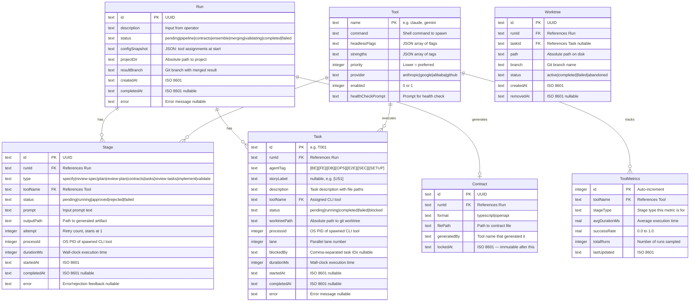

# Data Model: Multi-Model AI Orchestrator

**Storage**: SQLite (better-sqlite3, synchronous)
**Location**: `~/.orch/orch.db` (user-level, not project-level)

---

## Entity Relationship



---

## SQLite DDL

```sql
-- schema.sql

CREATE TABLE IF NOT EXISTS runs (
    id TEXT PRIMARY KEY,
    description TEXT NOT NULL,
    status TEXT NOT NULL DEFAULT 'pending'
        CHECK (status IN ('pending','pipeline','contracts','ensemble','merging','validating','completed','failed')),
    config_snapshot TEXT, -- JSON
    project_dir TEXT NOT NULL,
    result_branch TEXT,
    created_at TEXT NOT NULL DEFAULT (strftime('%Y-%m-%dT%H:%M:%SZ','now')),
    completed_at TEXT,
    error TEXT
);

CREATE TABLE IF NOT EXISTS stages (
    id TEXT PRIMARY KEY,
    run_id TEXT NOT NULL REFERENCES runs(id) ON DELETE CASCADE,
    type TEXT NOT NULL
        CHECK (type IN ('specify','review-spec','plan','review-plan','contracts','tasks','review-tasks','implement','validate')),
    tool_name TEXT NOT NULL,
    status TEXT NOT NULL DEFAULT 'pending'
        CHECK (status IN ('pending','running','approved','rejected','failed')),
    prompt TEXT,
    output_path TEXT,
    attempt INTEGER NOT NULL DEFAULT 1,
    process_id INTEGER,
    duration_ms INTEGER,
    started_at TEXT,
    completed_at TEXT,
    error TEXT
);

CREATE TABLE IF NOT EXISTS tasks (
    id TEXT PRIMARY KEY, -- T001, T002, etc.
    run_id TEXT NOT NULL REFERENCES runs(id) ON DELETE CASCADE,
    agent_tag TEXT NOT NULL
        CHECK (agent_tag IN ('[BE]','[FE]','[DB]','[OPS]','[E2E]','[SEC]','[SETUP]')),
    story_label TEXT, -- [US1], [US2], etc.
    description TEXT NOT NULL,
    tool_name TEXT,
    status TEXT NOT NULL DEFAULT 'pending'
        CHECK (status IN ('pending','running','completed','failed','blocked')),
    worktree_path TEXT,
    process_id INTEGER,
    lane INTEGER,
    blocked_by TEXT, -- comma-separated task IDs
    duration_ms INTEGER,
    started_at TEXT,
    completed_at TEXT,
    error TEXT
);

CREATE TABLE IF NOT EXISTS tools (
    name TEXT PRIMARY KEY,
    command TEXT NOT NULL,
    headless_flags TEXT, -- JSON array
    strengths TEXT, -- JSON array
    priority INTEGER NOT NULL DEFAULT 99,
    provider TEXT,
    enabled INTEGER NOT NULL DEFAULT 1,
    health_check_prompt TEXT
);

CREATE TABLE IF NOT EXISTS tool_metrics (
    id INTEGER PRIMARY KEY AUTOINCREMENT,
    tool_name TEXT NOT NULL REFERENCES tools(name),
    stage_type TEXT NOT NULL,
    avg_duration_ms REAL,
    success_rate REAL,
    total_runs INTEGER NOT NULL DEFAULT 0,
    last_updated TEXT NOT NULL DEFAULT (strftime('%Y-%m-%dT%H:%M:%SZ','now'))
);

CREATE TABLE IF NOT EXISTS contracts (
    id TEXT PRIMARY KEY,
    run_id TEXT NOT NULL REFERENCES runs(id) ON DELETE CASCADE,
    format TEXT NOT NULL CHECK (format IN ('typescript','openapi')),
    file_path TEXT NOT NULL,
    generated_by TEXT NOT NULL,
    locked_at TEXT
);

CREATE TABLE IF NOT EXISTS worktrees (
    id TEXT PRIMARY KEY,
    run_id TEXT NOT NULL REFERENCES runs(id) ON DELETE CASCADE,
    task_id TEXT REFERENCES tasks(id),
    path TEXT NOT NULL,
    branch TEXT NOT NULL,
    status TEXT NOT NULL DEFAULT 'active'
        CHECK (status IN ('active','completed','failed','abandoned')),
    created_at TEXT NOT NULL DEFAULT (strftime('%Y-%m-%dT%H:%M:%SZ','now')),
    removed_at TEXT
);

-- Indexes
CREATE INDEX IF NOT EXISTS idx_stages_run ON stages(run_id);
CREATE INDEX IF NOT EXISTS idx_tasks_run ON tasks(run_id);
CREATE INDEX IF NOT EXISTS idx_tasks_status ON tasks(status);
CREATE INDEX IF NOT EXISTS idx_worktrees_run ON worktrees(run_id);
CREATE INDEX IF NOT EXISTS idx_worktrees_status ON worktrees(status);
CREATE INDEX IF NOT EXISTS idx_tool_metrics_tool ON tool_metrics(tool_name, stage_type);
```

---

## State Machines

### Run Status Flow
```
pending → pipeline → contracts → ensemble → merging → validating → completed
                                                                  ↘ failed (at any point)
```

### Stage Status Flow
```
pending → running → approved (for review stages)
                  → rejected → running (retry, up to maxRetries)
                  → failed
```

### Task Status Flow
```
pending → running → completed
                  → failed → blocked (cascade to dependents)
```

### Worktree Status Flow
```
active → completed (merged successfully)
       → failed (task failed)
       → abandoned (process crashed, cleanup pending)
```
