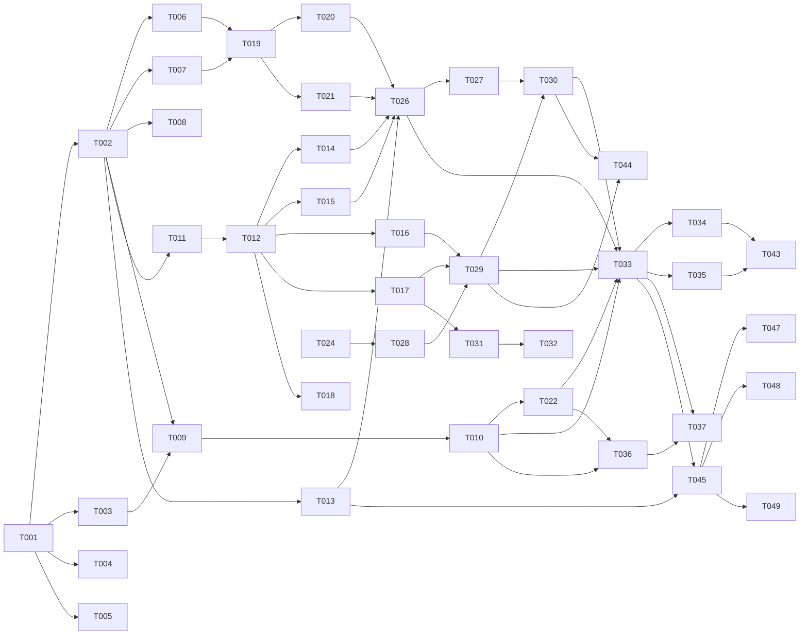

# Tasks: Multi-Model AI Orchestrator

**Input**: Design documents from `/specs/001-orchestrator/`
**Prerequisites**: plan.md (required), spec.md (required), research.md, data-model.md, contracts/

**Organization**: Tasks are grouped by user story. Each task is assigned to a specialist agent. Parallelism is derived from the Dependency Graph.

## Format: `[ID] [AGENT] [Story?] Description`

## Agent Tags

| Tag | Agent | Domain |
|-----|-------|--------|
| `[SETUP]` | — (orchestrator) | Project init, shared config, scaffolding |
| `[DB]` | database-architect | Schema, migrations, SQLite setup |
| `[BE]` | backend-specialist | Engine, process, parsers, services, CLI |
| `[FE]` | frontend-specialist | React Web UI components, hooks |
| `[OPS]` | devops-engineer | CI/CD, npm publishing, Docker |
| `[E2E]` | test-engineer | Cross-boundary integration tests |

## Task Statuses

| Status | Meaning |
|--------|---------|
| `- [ ]` | Pending |
| `- [→]` | In progress |
| `- [X]` | Completed |
| `- [!]` | Failed |
| `- [~]` | Blocked (cascade from a failed dependency) |

---

## Phase 1: Setup (Shared Infrastructure)

**Purpose**: Project initialization, monorepo structure, shared dependencies

- [X] T001 [SETUP] Create monorepo structure with root package.json (npm workspaces) and packages/orchestrator/ directory per plan.md
- [X] T002 [SETUP] Initialize packages/orchestrator/package.json with all dependencies: execa, better-sqlite3, strip-ansi, tree-kill, @modelcontextprotocol/sdk, commander, yaml, hono, eventemitter3, zod, pino, uuid
- [X] T003 [SETUP] Configure packages/orchestrator/tsconfig.json with strict mode, ESM output, path aliases
- [X] T004 [SETUP] Create orch.config.example.yaml with default tool registry (claude, gemini, qwen-code) per research.md R8 config format
- [X] T005 [SETUP] Create packages/orchestrator/vitest.config.ts for unit + integration testing

---

## Phase 2: Foundational (Blocking Prerequisites)

**Purpose**: Core infrastructure that MUST be complete before ANY user story

**⚠️ CRITICAL**: No user story work can begin until this phase is complete

- [X] T006 [BE] Implement AppError classes with typed error codes in packages/orchestrator/src/utils/errors.ts
- [X] T007 [BE] Implement structured logger (pino) with JSON output in packages/orchestrator/src/utils/logger.ts — no console.log
- [X] T008 [BE] Implement git utility functions (worktree create/remove, merge, branch) in packages/orchestrator/src/utils/git.ts with typed inputs/outputs
- [X] T009 [BE] Implement Zod schemas for orch.config.yaml validation in packages/orchestrator/src/config/schema.ts — cover tools, pipeline, ensemble, defaults sections per contracts/tool-registry.ts
- [X] T010 [BE] Implement config loader with Zod validation and global+local merge strategy in packages/orchestrator/src/config/loader.ts with typed inputs/outputs
- [X] T011 [DB] Create SQLite DDL in packages/orchestrator/src/db/schema.sql per data-model.md — all 7 tables with WAL pragma
- [X] T012 [DB] Implement better-sqlite3 client wrapper with WAL mode init, `db.transaction(fn)` helper for multi-table atomic ops, and typed query helpers in packages/orchestrator/src/db/client.ts
- [X] T013 [BE] Implement typed EventBus (eventemitter3) in packages/orchestrator/src/events/bus.ts per contracts/events.ts OrchEvent union type

**Checkpoint**: Foundation ready — all utils, config, DB, event bus operational

---

## Phase 3: User Story 1 — CLI Pipeline Orchestration (Priority: P1) 🎯 MVP

**Goal**: Operator runs `orch run "<description>"` and gets idea → spec → review → plan → review → contracts → tasks → parallel implement → merge → validate

**Independent Test**: Run `orch run "Add user auth" --dry-run` to see pipeline plan. Run with real tools to verify full flow.

### DB Layer for US1

- [X] T014 [DB] [US1] Implement Run CRUD (create, update status, get by ID, list) in packages/orchestrator/src/db/runs.ts with parameterized queries
- [X] T015 [DB] [US1] Implement Stage CRUD (create, update, list by run) in packages/orchestrator/src/db/stages.ts with parameterized queries
- [X] T016 [DB] [US1] Implement Task CRUD (create, update status, list by run, cascade block) in packages/orchestrator/src/db/tasks.ts with parameterized queries
- [X] T017 [DB] [US1] Implement Worktree registry CRUD (create, update status, list active, list orphans) in packages/orchestrator/src/db/worktrees.ts with parameterized queries
- [X] T018 [DB] [US1] Implement Contract CRUD (create, lock, get by run) in packages/orchestrator/src/db/contracts.ts with parameterized queries

### Process Layer for US1

- [X] T019 [BE] [US1] Implement tool spawner using execa v9 with headless flags, timeout, and stream-json output capture in packages/orchestrator/src/process/spawner.ts with typed inputs/outputs
- [X] T020 [BE] [US1] Implement output filter: strip-ansi + custom cursor/spinner removal + line buffering (collect by \n before parsing) + semantic line extraction in packages/orchestrator/src/process/output-filter.ts
- [X] T021 [BE] [US1] Implement watchdog: no-stdout timeout detection (default 60s silence → kill), process tree kill via tree-kill, stderr parsing for "rate limit"/"429" detection in packages/orchestrator/src/process/watchdog.ts

### Tool Registry for US1

- [X] T022 [BE] [US1] Implement tool registry: load from config, health check via spawning tool with test prompt, list tools in packages/orchestrator/src/registry/tool-registry.ts with typed inputs/outputs
- [X] T023 [BE] [US1] Implement tool registry types matching contracts/tool-registry.ts in packages/orchestrator/src/registry/types.ts

### Parsers for US1

- [X] T024 [BE] [US1] Implement tasks.md parser: extract tasks with agent tags, story labels, file paths, build dependency graph in packages/orchestrator/src/parsers/tasks-parser.ts per contracts/run-engine.ts DependencyGraph interface
- [X] T025 [BE] [US1] Implement review output parser: first line APPROVE/REJECT, remaining = feedback in packages/orchestrator/src/parsers/review-parser.ts per FR-019

### Engine Layer for US1

- [X] T026 [BE] [US1] Implement pipeline engine: sequential stage execution with quality gates, rejection loop (max retries), stage status tracking in packages/orchestrator/src/engine/pipeline.ts per contracts/run-engine.ts PipelineResult
- [X] T027 [BE] [US1] Implement contract generation phase: spawn tool to generate TypeScript interfaces from plan/data-model, lock files read-only in packages/orchestrator/src/engine/contracts.ts
- [X] T028 [BE] [US1] Implement dependency scheduler: parse graph → topological sort → identify parallel groups → assign lanes in packages/orchestrator/src/engine/scheduler.ts per contracts/run-engine.ts DependencyGraph
- [X] T029 [BE] [US1] Implement ensemble engine: sequential worktree creation (avoid git lock), parallel tool dispatch per lane with full context injection (spec.md + plan.md + contracts/ + task description in prompt), cascade failure handling in packages/orchestrator/src/engine/ensemble.ts per contracts/run-engine.ts EnsembleResult
- [X] T030 [BE] [US1] Implement merger: git merge worktrees → result branch, run build validation command, dispatch merge reviewer on failure in packages/orchestrator/src/engine/merger.ts per contracts/run-engine.ts MergeResult

### Worktree Management for US1

- [X] T031 [BE] [US1] Implement worktree manager: create with branch (SERIALIZED — sequential creation to avoid git index.lock conflicts), symlink node_modules, cleanup, orphan GC (>24h) in packages/orchestrator/src/worktree/manager.ts
- [X] T032 [BE] [US1] Implement scope guard: generate ORCHESTRATOR_INSTRUCTIONS.md in worktree root, chmod 444 contracts in packages/orchestrator/src/worktree/scope-guard.ts

### CLI Entry for US1

- [X] T033 [BE] [US1] Implement CLI entry with commander: `orch run`, `orch status`, `orch tools list`, `orch tools test`, `orch config set/get`, `orch cleanup`, `orch stats` in packages/orchestrator/src/index.ts with Zod validation on all args
- [X] T034 [BE] [US1] Implement `orch run` command: wire pipeline → contracts → ensemble → merge → validate flow, support --dry-run flag in packages/orchestrator/src/index.ts
- [X] T035 [BE] [US1] Implement graceful shutdown: SIGINT/SIGTERM trap, tree-kill all children, cleanup worktrees, update run status in packages/orchestrator/src/index.ts

### MCP Server for US1

- [X] T036 [BE] [US1] Implement MCP server with StdioServerTransport: orch.run, orch.status, orch.dispatch_task, orch.merge, orch.tools_list, orch.cleanup tools in packages/orchestrator/src/mcp/server.ts per contracts/mcp-server.ts
- [X] T037 [BE] [US1] Implement MCP tool definitions with Zod input schemas in packages/orchestrator/src/mcp/tools.ts

### Unit Tests for US1

- [X] T038 [BE] [US1] Write unit tests for config schema validation (valid + invalid YAML) in packages/orchestrator/tests/unit/config/schema.test.ts
- [X] T039 [BE] [US1] Write unit tests for tasks-parser (parse tasks, build graph, detect cycles) in packages/orchestrator/tests/unit/parsers/tasks-parser.test.ts
- [X] T040 [BE] [US1] Write unit tests for review-parser (APPROVE, REJECT, malformed) in packages/orchestrator/tests/unit/parsers/review-parser.test.ts
- [X] T041 [BE] [US1] Write unit tests for scheduler (topological sort, parallel groups, critical path) in packages/orchestrator/tests/unit/engine/scheduler.test.ts
- [X] T042 [BE] [US1] Write unit tests for worktree manager (create, cleanup, GC) in packages/orchestrator/tests/unit/worktree/manager.test.ts

### Integration Tests for US1

- [X] T043 [E2E] [US1] Write integration test for full pipeline with mock CLI tools (execa mock) in packages/orchestrator/tests/integration/pipeline.test.ts
- [X] T044 [E2E] [US1] Write integration test for ensemble with mock tools + real worktrees in packages/orchestrator/tests/integration/ensemble.test.ts

**Checkpoint**: User Story 1 complete — `orch run` works end-to-end with CLI output

---

## Phase 4: User Story 2 — Web UI with Live Progress Dashboard (Priority: P2)

**Goal**: React web UI with SSE live dashboard showing pipeline stages, lane progress, dependency graph

**Independent Test**: Start run via CLI, open localhost:3000, verify SSE updates in real-time

### API Layer for US2

- [X] T045 [BE] [US2] Implement Hono HTTP server with CORS in packages/orchestrator/src/api/server.ts
- [X] T046 [BE] [US2] Implement SSE emitter helper (typed events from EventBus → SSE stream) in packages/orchestrator/src/api/sse.ts
- [X] T047 [BE] [US2] Implement runs API routes: GET /api/runs, POST /api/runs, GET /api/runs/:id in packages/orchestrator/src/api/routes/runs.ts with Zod validation
- [X] T048 [BE] [US2] Implement SSE endpoint: GET /api/runs/:id/events in packages/orchestrator/src/api/routes/events.ts
- [X] T049 [BE] [US2] Implement tools API route: GET /api/tools in packages/orchestrator/src/api/routes/tools.ts

### Frontend for US2

- [X] T050 [FE] [US2] Initialize web/ with package.json, Vite + React + TypeScript setup in packages/orchestrator/web/
- [X] T051 [FE] [US2] Implement useSSE hook for consuming server-sent events with reconnection in packages/orchestrator/web/src/hooks/useSSE.ts
- [X] T052 [FE] [US2] Implement API client for REST endpoints in packages/orchestrator/web/src/lib/api.ts
- [X] T053 [FE] [US2] Implement PipelineView component: stage visualization with current/completed/failed states in packages/orchestrator/web/src/components/PipelineView.tsx
- [X] T054 [FE] [US2] Implement LaneProgress component: per-lane progress bars with tool name and task status in packages/orchestrator/web/src/components/LaneProgress.tsx
- [X] T055 [FE] [US2] Implement DependencyGraph component: visual node graph with status-based coloring in packages/orchestrator/web/src/components/DependencyGraph.tsx
- [X] T056 [FE] [US2] Implement RunHistory component: list of completed runs with summary stats in packages/orchestrator/web/src/components/RunHistory.tsx
- [X] T057 [FE] [US2] Implement App.tsx: layout with router, connect all components in packages/orchestrator/web/src/App.tsx

**Checkpoint**: Web UI shows live pipeline + ensemble progress via SSE

---

## Phase 5: User Story 3 — Adaptive Model Routing & Performance Tracking (Priority: P3)

**Goal**: Track per-tool metrics, show leaderboard, enable adaptive routing based on historical performance

**Independent Test**: Run 5+ orchestrations, verify `orch stats` shows per-tool metrics, enable adaptive routing

- [X] T058 [DB] [US3] Implement ToolMetrics aggregation queries (avg duration, success rate, per stage type) in packages/orchestrator/src/db/metrics.ts with parameterized queries
- [X] T059 [BE] [US3] Implement metrics collection: record duration + success/fail after each stage/task completion in packages/orchestrator/src/engine/pipeline.ts and ensemble.ts
- [X] T060 [BE] [US3] Implement `orch stats` command: query ToolMetrics, display table with "best for" recommendations in packages/orchestrator/src/index.ts
- [X] T061 [BE] [US3] Implement adaptive routing: query ToolMetrics → select tool with highest success rate for each stage type, fallback to config default in packages/orchestrator/src/registry/tool-registry.ts
- [X] T062 [FE] [US3] Implement ToolLeaderboard component: per-tool metrics table with sorting in packages/orchestrator/web/src/components/ToolLeaderboard.tsx

**Checkpoint**: Adaptive routing works, metrics dashboard shows per-tool performance

---

## Phase 6: Polish & Cross-Cutting Concerns

**Purpose**: Improvements that affect multiple user stories

- [X] T063 [OPS] Create .github/workflows/ci.yml with lint + typecheck + test for packages/orchestrator
- [X] T064 [OPS] Create Dockerfile for packages/orchestrator (optional containerized deployment)
- [X] T065 [BE] Add `orch nuke` command: hard reset — drop all runs, remove all worktrees, reset DB in packages/orchestrator/src/index.ts
- [X] T066 [SEC] Security review: verify no API keys in logs, validate config env var references only, audit worktree cleanup
- [X] T067 [BE] Add npm bin configuration for global `orch` command in packages/orchestrator/package.json

---

## Dependency Graph

### Legend

- `→` means "unlocks" (left must complete before right can start)
- `+` means "all of these" (join point)
- Tasks not listed here have no dependencies and can start immediately within their phase

### Dependencies

T001 → T002, T003, T004, T005
T002 → T006, T007, T008, T009, T011, T013
T003 → T009
T009 → T010
T011 → T012
T012 → T014, T015, T016, T017, T018
T006 + T007 → T019
T010 → T022
T019 → T020, T021
T022 → T023
T020 + T021 → T026
T013 + T014 + T015 → T026
T026 → T027
T024 → T028
T028 → T029
T016 + T017 → T029
T027 + T029 → T030
T017 → T031
T031 → T032
T010 + T022 + T026 + T029 + T030 → T033
T033 → T034, T035
T033 + T036 → T037
T010 + T022 → T036
T009 → T038
T024 → T039
T025 → T040
T028 → T041
T031 → T042
T034 + T035 → T043
T029 + T030 → T044
T013 + T033 → T045
T013 → T046
T045 → T047, T048, T049
T047 + T048 → T050
T050 → T051, T052
T051 + T052 → T053, T054, T055, T056
T053 + T054 + T055 + T056 → T057
T012 → T058
T026 + T029 → T059
T033 + T058 → T060
T058 + T059 → T061
T050 + T058 → T062
T034 → T063
T034 → T064
T033 → T065
T034 → T066
T002 → T067

### Self-Validation Checklist

> - [X] Every task ID in Dependencies exists in the task list above
> - [X] No circular dependencies
> - [X] No orphan task IDs referenced that don't exist
> - [X] Fan-in uses `+` only, fan-out uses `,` only
> - [X] No chained arrows on a single line

---

## Dependency Visualization

---

## Parallel Lanes

| Lane | Agent Flow | Tasks | Blocked By |
|------|-----------|-------|------------|
| 1 | [SETUP] | T001 → T002 → T003, T004, T005 | — |
| 2 | [DB] | T011 → T012 → T014, T015, T016, T017, T018 | T002 |
| 3 | [BE] utils | T006, T007 → T019 → T020, T021 | T002 |
| 4 | [BE] config | T009 → T010 → T022, T023 | T002, T003 |
| 5 | [BE] parsers | T024, T025 → T028 | T002 |
| 6 | [BE] engine | T026 → T027 → T030 | T013 + T014 + T015 + T020 + T021 |
| 7 | [BE] ensemble | T029 → T030 | T016 + T017 + T028 |
| 8 | [BE] worktree | T031 → T032 | T017 |
| 9 | [BE] CLI | T033 → T034, T035, T065 | T010 + T022 + T026 + T029 + T030 |
| 10 | [BE] MCP | T036 → T037 | T010 + T022 |
| 11 | [BE] API | T045 → T046, T047, T048, T049 | T013 + T033 |
| 12 | [FE] | T050 → T051, T052 → T053-T057 | T047 + T048 |
| 13 | [E2E] | T043, T044 | T034 + T029 |
| 14 | [DB] metrics | T058 | T012 |
| 15 | [BE] adaptive | T059, T060, T061 | T026 + T029 + T033 + T058 |
| 16 | [OPS] | T063, T064, T067 | T034 |
| 17 | [SEC] | T066 | T034 |

---

## Agent Summary

| Agent | Task Count | Can Start After |
|-------|-----------|-----------------|
| [SETUP] | 5 | immediately |
| [DB] | 8 | T002 |
| [BE] | 40 | T002 |
| [FE] | 9 | T047 + T048 |
| [OPS] | 3 | T034 |
| [E2E] | 2 | T034 + T029 |
| [SEC] | 1 | T034 |

**Critical Path**: T001 → T002 → T011 → T012 → T014 → T026 → T027 → T030 → T033 → T034 → T043

---

## Implementation Strategy

### MVP First (User Story 1 Only)

1. Complete Phase 1: Setup
2. Complete Phase 2: Foundational (CRITICAL)
3. Complete Phase 3: User Story 1
4. **STOP and VALIDATE**: `orch run --dry-run` works, full pipeline + ensemble with real tools
5. Deploy/demo if ready

### Incremental Delivery

1. Setup + Foundational → core infrastructure ready
2. User Story 1 → `orch run` end-to-end (MVP!)
3. User Story 2 → Web UI dashboard with SSE
4. User Story 3 → Adaptive routing + metrics
5. Polish → CI/CD, security audit, npm publish

### Parallel Agent Strategy (Claude Code)

1. Orchestrator completes Phase 1 Setup directly
2. After Phase 1 sync barrier → dispatch parallel:
   - Lane 2 [DB]: database-architect → schema, CRUD for all tables
   - Lane 3 [BE] utils: backend-specialist → errors, logger, git utils
   - Lane 4 [BE] config: backend-specialist → zod schemas, config loader
3. As DB completes → unblock engine + ensemble lanes
4. As config + registry complete → unblock CLI + MCP lanes
5. [FE] starts only when API routes are ready (P2)
6. [E2E] starts when pipeline + ensemble both work
7. [SEC] runs after all P1 implementation complete

### Multi-Session Strategy (Gemini / Copilot)

1. Complete Setup + Foundational sequentially
2. Use Agent Summary to decide role context switching
3. Follow Dependency Graph for correct execution order
4. Optionally launch parallel sessions per lane manually

---

## Notes

- `[AGENT]` tag assigns responsibility — domain agent writes both code and unit tests
- `[E2E]` only for cross-boundary tests — unit tests stay with domain agent [BE]
- `[SEC]` conditional — security audit after all P1 implementation
- Phases are sync barriers — all tasks in a phase must complete/fail/block before next phase
- This project is heavily [BE] weighted (40/67 tasks) because it's primarily a backend CLI tool
- [FE] tasks are P2 only — not needed for MVP
- Commit after each task or logical group
