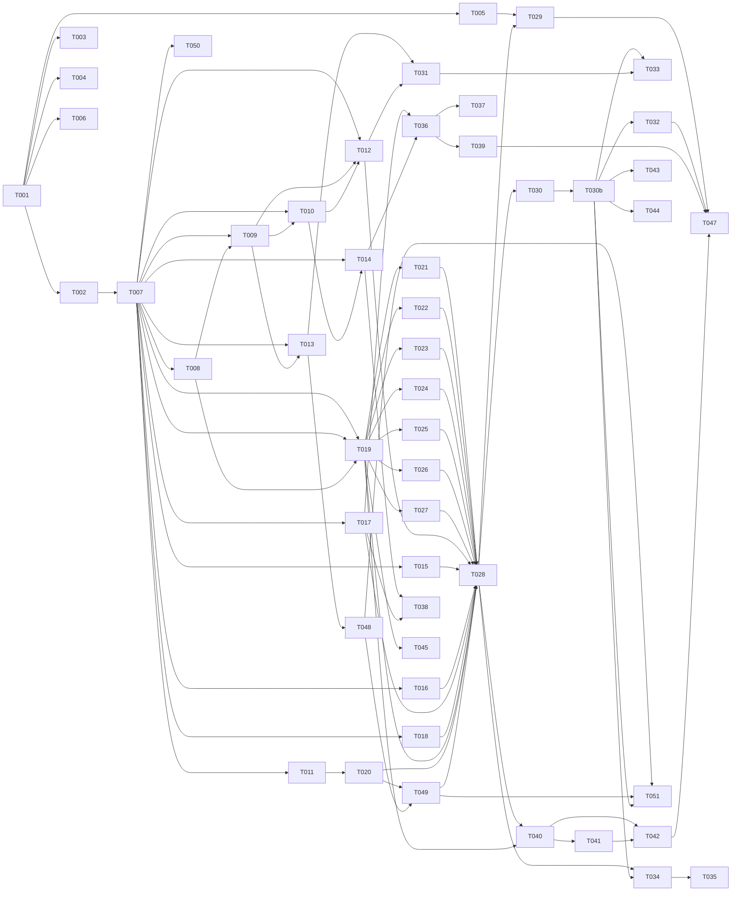

# Tasks: AI Helpers Distribution System

**Input**: Design documents from `/specs/002-ai-helpers-reuse/`
**Prerequisites**: plan.md, spec.md (v3.2), research.md, data-model.md, contracts/cli.md, contracts/transformer.md, contracts/manifest.md, contracts/lock.md, quickstart.md

**Tests**: Yes — spec.md SC-002 through SC-009 require golden tests, integration tests, and drift scenario fixtures. Tests are included per-phase.

**Organization**: Tasks are grouped by user story (US1–US5 from spec.md) to enable independent implementation and testing. Each task is assigned to a specialist agent for domain-aware execution.

## Format: `[ID] [AGENT] [Story?] Description`

- **[AGENT]**: Specialist agent responsible for the task (see Agent Tags below)
- **[Story]**: Which user story this task belongs to (e.g., US1, US2, US3)
- Include exact file paths in descriptions
- Parallelism is derived from the Dependency Graph — tasks with no dependencies can run in parallel

## Agent Tags

| Tag | Agent | Domain |
|-----|-------|--------|
| `[SETUP]` | — (orchestrator) | Project init, shared config, scaffolding, shared dependency installs |
| `[BE]` | backend-specialist | Core library, CLI handlers, transformers, services + unit tests |
| `[E2E]` | test-engineer | Cross-boundary integration tests (full init/sync/recover flows) |

**Note**: This project is a CLI tool (npm package). No database, no frontend, no deployment infra in v1. Only `[SETUP]`, `[BE]`, and `[E2E]` agents are used.

## Task Statuses

| Status | Meaning |
|--------|---------|
| `- [ ]` | Pending |
| `- [→]` | In progress |
| `- [X]` | Completed |
| `- [!]` | Failed |
| `- [~]` | Blocked (cascade from a failed dependency) |

## Path Conventions

All paths are relative to `packages/underundre-helpers/` (the npm package root within this repo).

---

## Phase 1: Setup (Shared Infrastructure)

**Purpose**: Project scaffolding, dependency installation, test fixture preparation

- [X] T001 [SETUP] Create project directory structure at `packages/cli/` per plan.md: `src/`, `src/cli/`, `src/core/`, `src/transformers/`, `src/types/`, `tests/unit/`, `tests/integration/`, `tests/fixtures/`, `bin/`
- [X] T002 [SETUP] Initialize `package.json` with name `clai-helpers`, bin entry `helpers`, ESM type, Node 20+ engines, and install dependencies: `giget`, `c12`, `citty`, `consola`, `pathe`, `defu`; devDependencies: `vitest`, `typescript`, `@types/node`
- [X] T003 [SETUP] Configure `tsconfig.json` (ESM, strict, NodeNext module resolution, paths), `vitest.config.ts`, and `.gitignore` (ignore `.helpers/`, `node_modules/`, `dist/`)
- [X] T004 [SETUP] Create test fixture source repo at `tests/fixtures/source-repo/` with: `.claude/commands/commit.md`, `.claude/commands/deploy.md`, `.claude/agents/debugger.md`, `.claude/CLAUDE.md` (with Protected Slot), `.claude/settings.json`, and `helpers.config.ts` manifest declaring claude/copilot/gemini targets
- [X] T005 [SETUP] Create golden output fixtures at `tests/fixtures/golden/` for each built-in transformer: `golden/copilot/prompts/commit.prompt.md`, `golden/copilot/instructions/debugger.instructions.md`, `golden/copilot/copilot-instructions.md`, `golden/gemini/commands/commit.toml`, `golden/gemini/agents/debugger.md`, `golden/gemini/GEMINI.md`, `golden/claude/` (identity copies)
- [X] T006 [SETUP] Create `bin/helpers.mjs` entry point (`#!/usr/bin/env node` + dynamic import of `../dist/cli.js`)

**Checkpoint**: Project scaffolded, dependencies installed, fixtures ready

---

## Phase 2: Foundational (Core Library)

**Purpose**: All core utilities that MUST exist before any CLI command or transformer can be implemented

**⚠️ CRITICAL**: No user story work can begin until this phase is complete

- [X] T007 [BE] Define all TypeScript types and enums in `src/types/common.ts` (FileKind, FileClass, FileStatus, ExitCode), `src/types/config.ts` (HelpersConfig, TargetConfig, TransformerPipeline), `src/types/lock.ts` (LockFile, LockSource, LockFileEntry, SourceEntry, GeneratedEntry, TrustedTransformer), `src/types/journal.ts` (Journal, JournalOperation) per data-model.md with typed discriminated unions and strict enums
- [X] T008 [BE] Define transformer type interfaces in `src/transformers/types.ts` (ParsedFile, TransformContext, RenderedFile, TransformerFn) per contracts/transformer.md with typed function signatures
- [X] T009 [BE] Implement `src/core/hash.ts`: canonicalHash (sha256 with LF normalization + slot placeholder replacement per FR-018b), slotsHash (concatenated slot bodies with \x00 separator), renderedHash (raw bytes). Use Node.js built-in `crypto.createHash('sha256')`. Export typed functions with string return format `sha256:<hex>`. Add unit test in `tests/unit/hash.test.ts` covering: plain file, file with slots, file with header, LF/CRLF normalization
- [X] T010 [BE] Implement `src/core/slots.ts`: Protected Slots parser with format-aware marker detection (markdown/html, yaml/hash-comment, js/ts/jsonc, plain JSON rejection per FR-013). Functions: `parseSlots(content, ext) → SlotBlock[]`, `mergeSlots(newContent, existingSlots, ext) → string`, `validateSlotPairing(content, ext) → Error | null`. Add unit test in `tests/unit/slots.test.ts` covering: balanced markers, unbalanced error, multiple slots, format detection, nested marker as literal, JSON rejection
- [X] T011 [BE] Implement `src/core/header.ts`: auto-generated header inject/strip/detect per FR-010 contract. Functions: `injectHeader(content, sourcePath, commit, version, ext) → string`, `stripHeader(content, ext) → string`, `detectHeader(content, ext) → { valid: boolean, sourcePath?: string } | null` (null for headerless formats). Handle plain JSON special case (no header, null return). Add unit test in `tests/unit/header.test.ts` covering: each comment format, JSON returns null, header round-trip inject→strip
- [X] T012 [BE] Implement `src/core/staging.ts`: atomic file staging at `<root>/.helpers/staging/`. Functions: `createStagingDir(root) → string`, `stageFile(stagingDir, content, targetPath) → string`, `commitStaged(stagedPath, targetPath) → void` (fs.rename with EXDEV fallback to copyFile+unlink per FR-019), `cleanStaging(root) → void`. All paths normalized via `pathe`
- [X] T013 [BE] Implement `src/core/journal.ts`: Write-Ahead Journal per FR-020. Functions: `createJournal(root, command, operations, preLockHash) → Journal`, `writeJournal(root, journal) → void` (with fsync), `readJournal(root) → Journal | null`, `markOperationDone(root, journal, opId) → void`, `deleteJournal(root) → void`, `createBackup(root, runId, filePath) → string`. Add unit test in `tests/unit/journal.test.ts` covering: create/read round-trip, mark done, stale detection
- [X] T014 [BE] Implement `src/core/lock.ts`: lock file read/write/validate per contracts/lock.md. Functions: `readLock(root) → LockFile | null`, `writeLock(root, lock) → void`, `validateLock(lock) → Error[]`, `findEntry(lock, path) → LockFileEntry | undefined`, `updateEntry(lock, entry) → LockFile`. Validate schema version, unique paths, forward-slash normalization. Path normalization via `pathe`
- [X] T015 [BE] Implement `src/core/manifest.ts`: manifest loader via `c12` per contracts/manifest.md. Function: `loadManifest(sourceDir, overridePath?) → HelpersConfig`. Validate version=1, non-empty sources, pipeline match⊆sources, no duplicate output paths, transformer existence. Export `defineHelpersConfig` identity helper for type-safe manifests
- [X] T016 [BE] Implement `src/core/fetch.ts`: source repo fetch wrapper around `giget`. Function: `fetchSource(url, ref?, auth?, options?) → { dir: string, commit: string }`. Auth resolution order: (1) explicit `auth` param, (2) `GH_TOKEN` env, (3) `GIGET_AUTH` env, (4) `gh auth token` subprocess call if `gh` CLI is available on PATH (FR-021 full fallback chain). Support `offline`/`preferOffline` for NFR-002. Resolve commit SHA via GitHub API (`GET /repos/{owner}/{repo}/commits/{ref}`) or giget response metadata — do NOT use `git rev-parse` (giget downloads flat snapshots without `.git/`). Add unit test in `tests/unit/fetch.test.ts` covering: auth resolution order (mock env + subprocess), offline mode error when no cache
- [X] T017 [BE] Implement `src/core/drift.ts`: drift detection per FR-018b. Functions: `detectDrift(entry, localContent) → DriftResult`, `computeSourceDrift(entry, localContent, ext) → { isDrift: boolean, isCustomized: boolean }`, `computeGeneratedDrift(entry, localContent) → boolean`. Uses hash.ts and slots.ts. Add unit test in `tests/unit/drift.test.ts` covering: clean file, slot-only edit (no drift), outside-slot edit (drift), generated edit (drift), config-init (never drift)
- [X] T018 [BE] Implement `src/core/trust.ts`: custom transformer trust model per FR-007. Functions: `checkTrust(lock, transformerPath, fileHash) → TrustResult`, `recordTrust(lock, transformerPath, fileHash) → LockFile`, `revokeTrust(lock, transformerPath) → LockFile`, `warnLocalImports(content) → string[]`. TrustResult = `trusted | untrusted | revoked`. Add unit test in `tests/unit/trust.test.ts` covering: first-time untrusted, hash match trusted, hash change revoked, local import warning
- [X] T019 [BE] Implement transformer registry in `src/transformers/registry.ts`: Functions: `createRegistry(config, sourceDir) → TransformerRegistry`, `resolveTransformer(name) → TransformerFn` (built-in by name, custom by path with trust check), `listTransformers(registry) → TransformerInfo[]`. Register all 7 built-in transformers by name
- [X] T020 [BE] Setup CLI framework in `src/cli.ts` using `citty`: define main command with global flags per contracts/cli.md (--dry-run, --offline, --non-interactive, --interactive, --yes, --no-color, --json, --verbose), register all subcommands. Wire `consola` for logging with `NO_COLOR` support. Set process.exitCode per ExitCode enum
- [X] T048 [BE] Implement `src/core/process-lock.ts`: concurrency guard per FR-022. Functions: `acquireProcessLock(root) → void` (write PID to `<root>/.helpers/lock.pid`, abort if file exists and PID is alive), `releaseProcessLock(root) → void`, `isStaleProcessLock(root) → boolean` (check if recorded PID is still running, auto-clean if stale with warning). Add unit test in `tests/unit/process-lock.test.ts` covering: acquire/release round-trip, stale PID cleanup, double-acquire abort
- [X] T049 [BE] Add stale-journal gate to CLI framework in `src/cli.ts`: before executing ANY mutating command (`init`, `sync`, `remove`, `remove-target`, `add-target`), check for stale journal via `readJournal(root)`. If journal exists and is incomplete, refuse to proceed — print actionable error directing user to `helpers recover`, exit with code 3 (ExitCode.StaleJournal). Wire concurrency guard (T048): acquire process lock before execution, release in finally block. Read-only commands (`status`, `diff`, `doctor`, `list-transformers`) skip both guards.
- [X] T050 [BE] Implement `src/index.ts` package entry point (moved from Phase 8): export public API types (`HelpersConfig`, `defineHelpersConfig`, `TransformerFn`, `ParsedFile`, `RenderedFile`, `TransformContext`, all enums from `types/common.ts`) for programmatic use and custom transformer authoring. This must be available early so test fixtures and transformers can import types.

**Checkpoint**: Core library complete — all utilities tested, CLI skeleton ready, process lock + stale journal gate wired

---

## Phase 3: User Story 1 — Quick Project Setup (Priority: P1) 🎯 MVP

**Goal**: Run `npx underundre-helpers init` in a fresh directory and get `.claude/`, `.github/`, `.gemini/`, `CLAUDE.md`, `GEMINI.md`, and `helpers-lock.json` generated from a single source.

**Independent Test**: Run init in empty dir → verify all paths from manifest exist, all generated files have correct headers, lock file is valid with per-file hashes, golden output fixtures match.

### Transformers for US1

- [X] T021 [BE] [US1] Implement identity transformer in `src/transformers/identity.ts` with golden test in `tests/unit/transformers/identity.test.ts` — copy source content as-is, remap CLAUDE.md to root, pass through Protected Slot markers
- [X] T022 [BE] [US1] Implement `claude-to-copilot-prompt` transformer in `src/transformers/claude-to-copilot-prompt.ts` — extract description, write YAML frontmatter with `agent` field, strip Claude-specific frontmatter (tools, skills, model), inject auto-generated header. Golden test in `tests/unit/transformers/copilot-prompt.test.ts`
- [X] T023 [BE] [US1] Implement `claude-to-copilot-instructions` transformer in `src/transformers/claude-to-copilot-instructions.ts` — strip Claude frontmatter, keep description as leading paragraph, preserve body, inject header. Golden test in `tests/unit/transformers/copilot-instructions.test.ts`
- [X] T024 [BE] [US1] Implement `claude-to-copilot-root-instructions` transformer in `src/transformers/claude-to-copilot-root-instructions.ts` — rewrite `.claude/` references to `.github/` paths, strip Claude-specific sections, inject header. Golden test in `tests/unit/transformers/copilot-root.test.ts`
- [X] T025 [BE] [US1] Implement `claude-to-gemini-command` transformer in `src/transformers/claude-to-gemini-command.ts` — wrap Claude command markdown in TOML `prompt = """..."""`, extract description to TOML top-level field, embed frontmatter inside TOML string, inject header as TOML comment. Golden test in `tests/unit/transformers/gemini-command.test.ts`
- [X] T026 [BE] [US1] Implement `claude-to-gemini-agent` transformer in `src/transformers/claude-to-gemini-agent.ts` — strip tools/model/skills frontmatter, keep name+description, preserve body, inject header. Golden test in `tests/unit/transformers/gemini-agent.test.ts`
- [X] T027 [BE] [US1] Implement `claude-to-gemini-root` transformer in `src/transformers/claude-to-gemini-root.ts` — rewrite `.claude/` to `.gemini/` references, produce Gemini resource hierarchy format, inject header. Golden test in `tests/unit/transformers/gemini-root.test.ts`

### Init Command for US1

- [X] T028 [BE] [US1] Implement `init` command handler in `src/cli/init.ts` with typed inputs/outputs and structured error handling: fetch source via fetch.ts, load manifest via manifest.ts, resolve active targets (--targets flag), run all matching transformer pipelines per target, apply Protected Slots merge for conflicts (FR-015 menus), stage all files via staging.ts with journal (FR-020), write lock file last, handle --dry-run/--interactive/--trust-custom flags. Exit codes per contracts/cli.md

### Integration Test for US1

- [X] T029 [E2E] [US1] Integration test for full init flow in `tests/integration/init.test.ts`: (1) init in empty dir → verify all manifest paths exist, (2) generated files match golden fixtures (SC-002), (3) all generated files have AUTO-GENERATED header (except JSON), (4) lock file valid with correct hashes, (5) init with --targets claude → no Copilot/Gemini files, (6) init with conflict → .helpers_new created + exit code 2, (7) init with --interactive → simulated prompt (mock stdin)

**Checkpoint**: US1 complete — `npx underundre-helpers init` works end-to-end with all 3 targets

---

## Phase 4: User Story 2 — Automated Updates / Sync (Priority: P1)

**Goal**: Run `npx underundre-helpers sync --upgrade` to update `.claude/` source files and regenerate all Copilot/Gemini outputs, preserving Protected Slot content.

**Independent Test**: Modify a source file upstream, run sync, verify source updated + all generated outputs regenerated + slot content preserved byte-for-byte.

### Implementation for US2

- [X] T030 [BE] [US2] Implement sync **plan** phase in `src/cli/sync.ts` (part 1 — "Plan"): read existing lock, fetch source (version from lock or --upgrade/--version), load manifest, diff source manifest against lock to produce a typed `SyncPlan` object: list of files to add/update/delete/orphan, per-file class rules (core=update, config=skip unless new file, generated=always overwrite per AD-6), generated descendants of orphaned sources flagged for auto-delete. Export `computeSyncPlan(lock, manifest, sourceDir, options) → SyncPlan`. Handle --dry-run by printing plan and exiting. This task does NOT write any files — purely computational.
- [X] T030b [BE] [US2] Implement sync **apply** phase in `src/cli/sync.ts` (part 2 — "Apply"): given a `SyncPlan`, execute it through the journal system: acquire process lock (T048), check stale journal (T049), create backup for each overwritten file, apply Protected Slots merge for source files with drift (FR-015 menus), auto-delete generated descendants of orphans, stage all file writes via staging.ts, commit staged files, write lock last. Handle --interactive/--trust-custom flags. Release process lock in finally block.
- [X] T031 [BE] [US2] Implement `recover` command handler in `src/cli/recover.ts` per FR-020b: detect stale journal, offer --resume (re-attempt from first non-done), --rollback (restore from backup dir), --abandon (delete journal + backup + call `cleanStaging(root)` from T012 to also clean `.helpers/staging/`; requires --yes). Structured error messages with file paths. Release process lock after recovery completes.

### Integration Tests for US2

- [X] T032 [E2E] [US2] Integration test for sync flow in `tests/integration/sync.test.ts`: (1) sync --upgrade updates core files + regenerates all targets (SC-002), (2) Protected Slot content preserved byte-for-byte after sync (SC-003), (3) generated file with local edits silently overwritten + warning printed, (4) source file with outside-slot drift → .helpers_new + exit 2, (5) orphaned source → flagged in lock, generated descendants auto-deleted, (6) new config-class file scaffolded on sync --upgrade, (7) removed transformer → generated outputs auto-deleted
- [X] T033 [E2E] [US2] Integration test for recover flow in `tests/integration/recover.test.ts`: simulate crash mid-sync (kill after N journal entries), verify --rollback restores pre-sync state byte-identical, verify --resume completes remaining operations (SC-007)

**Checkpoint**: US2 complete — sync + recover work end-to-end

---

## Phase 5: User Story 3 — Version Pinning (Priority: P2)

**Goal**: Pin project to a specific tagged version; `sync` without `--upgrade` heals drift but doesn't move versions.

**Independent Test**: Init at v1.0.0 → verify files match. Create v1.1.0 upstream. Sync without --upgrade → no version change. Sync --upgrade → moves to v1.1.0.

### Implementation for US3

- [X] T034 [BE] [US3] Add version pinning logic to init and sync: resolve --version tag via giget ref, record exact commit SHA in lock (not branch name), sync without --upgrade re-validates against pinned version (heals drift only), sync --upgrade or --version moves to new version. Update lock.source.ref and lock.source.commit

### Integration Test for US3

- [X] T035 [E2E] [US3] Integration test for version pinning in `tests/integration/version-pinning.test.ts`: (1) init --version v1.0.0 → lock records v1.0.0, (2) sync without --upgrade → no version change, drift healed, (3) sync --upgrade → moves to latest, (4) sync --version v1.1.0 → moves to specific version

**Checkpoint**: US3 complete — version pinning works

---

## Phase 6: User Story 4 — CI Drift Detection (Priority: P2)

**Goal**: `status --strict` exits non-zero when managed files have been edited outside Protected Slots.

**Independent Test**: Edit a managed file outside slots → `status --strict` exits 2. Edit inside slot → exits 0.

### Implementation for US4

- [X] T036 [BE] [US4] Implement `status` command in `src/cli/status.ts` with typed outputs: read lock, recompute hashes for all tracked files, detect drift per FR-018b (canonical hash for sources, rendered hash for generated), report pending `.helpers_new` side-files, show orphans. --strict exits non-zero on any drift. --json outputs machine-readable. --targets filters scope
- [X] T037 [BE] [US4] Implement `diff` command in `src/cli/diff.ts`: fetch latest source (or use cache with --offline), compare against local files, show what would change on next sync. Accept optional path args to filter
- [X] T038 [BE] [US4] Implement `doctor` command in `src/cli/doctor.ts`: verify lock integrity (schema version, unique paths, all fromSource refs valid), rehash all tracked files, validate manifest against lock, report mismatches. --fix auto-corrects safe issues (recalculate hashes, rebuild missing .helpers/ dirs). --clean deletes all `.helpers_new` side-files

### Integration Test for US4

- [X] T039 [E2E] [US4] Integration test for status --strict in `tests/integration/status-strict.test.ts` with 30 drift scenarios per SC-006: (10) source files with outside-slot edits → drift, (10) generated files with local edits → drift, (5) source files with slot-only edits → no drift (customized), (5) config-init files with edits → no drift

**Checkpoint**: US4 complete — CI-safe drift detection works

---

## Phase 7: User Story 5 — Selective Target Generation (Priority: P3)

**Goal**: Init/manage only Claude, or Claude+Copilot, skipping Gemini.

**Independent Test**: `init --targets claude` → only `.claude/` + `CLAUDE.md`. Then `add-target copilot` → Copilot files appear. Then `remove-target copilot` → back to Claude-only, byte-identical (SC-009).

### Implementation for US5

- [X] T040 [BE] [US5] Implement `add-target` command in `src/cli/add-target.ts`: validate target name exists in manifest, run transformer pipelines for new target, add generated outputs to lock, update lock.targets array
- [X] T041 [BE] [US5] Implement `remove-target` command in `src/cli/remove-target.ts`: delete all generated files for the target from disk, remove from lock.files and lock.targets. Destructive — requires --yes or --interactive per FR-004

### Integration Test for US5

- [X] T042 [E2E] [US5] Integration test for selective targets in `tests/integration/targets.test.ts`: (1) init --targets claude → only Claude files, (2) add-target copilot → Copilot files generated, (3) remove-target copilot → byte-identical to step 1 (SC-009), (4) init --targets claude,copilot → both, no Gemini

**Checkpoint**: US5 complete — selective targets work

---

## Phase 8: Polish & Cross-Cutting Concerns

**Purpose**: Utility commands and cross-platform validation

- [X] T043 [BE] Implement `eject` command in `src/cli/eject.ts`: untrack file from lock (keep on disk), with --cascade to also untrack generated descendants if ejecting a source file
- [X] T044 [BE] Implement `remove` command in `src/cli/remove.ts`: delete file from disk + untrack from lock. Destructive — requires --yes or --interactive
- [X] T045 [BE] Implement `list-transformers` command in `src/cli/list-transformers.ts`: output built-in + custom transformers with names, descriptions, source match patterns. --json for machine-readable
- [X] T046 ~~moved to T050 in Phase 2~~ (see T050 above)
- [X] T047 [E2E] Cross-platform validation in `tests/integration/cross-platform.test.ts`: verify lock file path normalization (forward-slash only), LF normalization in hash computation, CRLF preservation on existing files (SC-008). Run in CI on Windows + macOS + Linux
- [X] T051 [E2E] Integration test for concurrency guard + stale-journal gate in `tests/integration/concurrency.test.ts`: (1) two parallel sync processes → second aborts with actionable error, (2) stale PID (dead process) → auto-cleaned with warning, (3) stale journal present → `init`/`sync`/`remove`/`add-target`/`remove-target` all refuse with exit code 3, (4) `status`/`diff`/`doctor`/`list-transformers` work normally with stale journal (read-only commands skip gate)

**Checkpoint**: All commands implemented, cross-platform validated

---

## Dependency Graph

### Legend

- `→` means "unlocks" (left must complete before right can start)
- `+` means "all of these" (join point — ALL listed tasks must complete)
- Tasks not listed here have no dependencies and can start immediately within their phase

### Dependencies

```
# Phase 1: Setup
T001 → T002, T003, T004, T005, T006

# Phase 2: Foundational — types unlock all core modules
T002 → T007
T007 → T008, T009, T010, T011, T012, T013, T014, T015, T016, T017, T018, T019, T050
T008 → T009
T009 → T010, T013
T010 → T014
T009 + T010 → T012
T013 → T048
T020 + T048 → T049

# Phase 2 → Phase 3: core + registry + CLI unlock transformers
T007 + T008 → T019
T019 → T021, T022, T023, T024, T025, T026, T027
T011 → T020

# Phase 3: transformers + core unlock init
T021 + T022 + T023 + T024 + T025 + T026 + T027 → T028
T012 + T015 + T016 + T017 + T018 + T019 + T020 + T049 → T028
T005 + T028 → T029

# Phase 4: init unlocks sync plan, then apply
T028 → T030
T030 → T030b
T013 + T012 → T031
T030b → T032
T030b + T031 → T033

# Phase 5: init + sync unlock version pinning
T028 + T030b → T034
T034 → T035

# Phase 6: core drift + lock unlock status/diff/doctor
T017 + T014 → T036
T036 → T037
T014 + T017 → T038
T036 → T039

# Phase 7: init + registry unlock target management
T028 + T019 → T040
T040 → T041
T040 + T041 → T042

# Phase 8: sync unlocks eject/remove, registry unlocks list-transformers
T030b → T043, T044
T019 → T045
T029 + T032 + T039 + T042 → T047
T048 + T049 + T030b → T051
```

### Self-Validation Checklist

> - [x] Every task ID in Dependencies exists in the task list above
> - [x] No circular dependencies (A→B→A)
> - [x] No orphan task IDs referenced that don't exist
> - [x] Fan-in uses `+` only, fan-out uses `,` only
> - [x] No chained arrows on a single line

---

## Dependency Visualization



---

## Parallel Lanes

| Lane | Agent Flow | Tasks | Blocked By |
|------|-----------|-------|------------|
| 1 | [SETUP] | T001 → T002, T003, T004, T005, T006 | — |
| 2 | [BE] core | T007 → T008 → T009 → T010..T018, T048, T050 | T002 |
| 3 | [BE] infra guards | T048 → T049 (process lock + stale journal gate) | T013, T020 |
| 4 | [BE] transformers | T019 → T021..T027 | T007, T008 |
| 5 | [BE] init | T028 | T021..T027 + all core + T049 |
| 6 | [BE] sync | T030 → T030b → T031 | T028 |
| 7 | [BE] status/diff/doctor | T036 → T037, T038 | T017, T014 |
| 8 | [BE] targets | T040 → T041 | T028, T019 |
| 9 | [BE] utility cmds | T043, T044, T045 | T030b/T019 |
| 10 | [E2E] integration | T029, T032, T033, T035, T039, T042, T047, T051 | respective impl tasks |

---

## Agent Summary

| Agent | Task Count | Can Start After |
|-------|-----------|-----------------|
| [SETUP] | 6 | immediately |
| [BE] | 38 | T002 (setup complete) |
| [E2E] | 8 | respective implementation tasks |
| **Total** | **52** | — |

**Critical Path**: T001 → T002 → T007 → T008 → T019 → T021..T027 → T028 → T030 → T030b → T032

Length: 11 sequential steps (Setup → Types → TransformerTypes → Registry → 7 Transformers → Init → Sync Plan → Sync Apply → Sync Integration Test)

---

## Implementation Strategy

### MVP First (User Story 1 Only)

1. Complete Phase 1: Setup (T001–T006)
2. Complete Phase 2: Foundational core (T007–T020)
3. Complete Phase 3: US1 transformers + init (T021–T029)
4. **STOP and VALIDATE**: `npx underundre-helpers init` works in empty dir, all 3 targets generated
5. Ship as v0.1.0 (init-only, no sync)

### Incremental Delivery

1. v0.1.0: Init only (US1) → test `npx` flow
2. v0.2.0: + Sync + Recover (US2) → real workflow
3. v0.3.0: + Version pinning (US3) + Status/Diff/Doctor (US4) → CI-ready
4. v1.0.0: + Selective targets (US5) + Polish (Phase 8) → feature-complete

### Parallel Agent Strategy (Claude Code)

1. **Orchestrator** completes Setup phase directly (T001–T006)
2. **backend-specialist** picks up Phase 2 core library (T007–T020) sequentially — these modules have internal deps
3. As soon as types (T007) + transformer types (T008) + registry (T019) are done, transformers (T021–T027) can be **parallelized** across multiple backend-specialist instances
4. **Init command** (T028) is the join point — waits for all transformers + all core
5. **E2E agent** (test-engineer) kicks in after each user story's implementation
6. Lanes 5–8 (sync, status, targets, utility) can proceed in parallel after init is done

### Multi-Session Strategy (Gemini / Copilot)

1. Complete Setup + Foundational sequentially (T001–T020)
2. Transformers (T021–T027) — batch as one session, they share patterns
3. Init + integration test (T028–T029) — one session
4. Sync + recover (T030–T033) — one session
5. Status/diff/doctor (T036–T039) — one session
6. Targets + utility (T040–T047) — one session

---

## Notes

- `[BE]` handles all library code AND its unit tests — each core module task includes its test
- `[E2E]` handles cross-boundary integration tests only (full init/sync/recover flows)
- No `[DB]`, `[FE]`, `[OPS]`, `[SEC]` agents — this is a pure CLI tool
- Commit after each task or logical group (e.g., all transformers as one commit)
- Stop at any checkpoint to validate the story independently
- All transformer tasks include golden tests (SC-004) — implement + test in same task
- Protected Slot tests are critical path — cover byte-for-byte preservation (SC-003)
